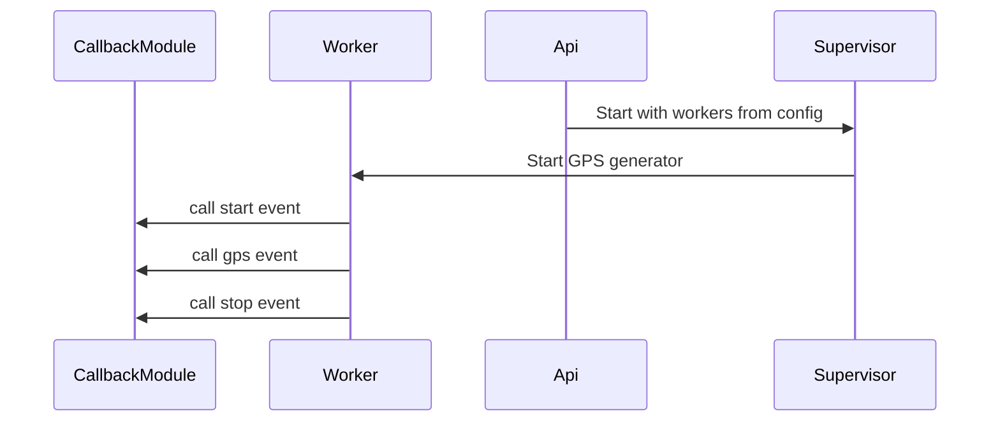

[](https://hexdocs.pm/location_simulator)
[](https://hex.pm/packages/location_simulator)

# LocationSimulator

*Important: We updated attribute for compatible with GPX. If you go to from older version, you need change attribue in state follow: :lati -> :lat, :long -> :lon, :elev -> :ele . Sorry for the inconvenience!*

Use for simulating location/GPS (longitude, latitude, elevation) data. Support scalable for test workload.

Source code is available on [Github](https://github.com/ohhi-vn/location_simulator)

Package for using on [Hex.pm](https://hex.pm/packages/location_simulator)

## Achitecture

The library has 3 main part:

1. Supervisor. Lib uses `PartitionSupervisor` for creating worker from config
2. Worker. Generating GPS with user config
3. Callback module. This is defined by user to handle event from worker

### Api call flow



*(for in local you need install extension support for mermaid to view flow)*

## Installation

Library can be installed
by adding `location_simulator` to your list of dependencies in `mix.exs`:

```elixir
def deps do
  [
    {:location_simulator, "~> 0.6"}
  ]
end
```

Library need to start before using APIs. If you need start with your app, you could add to `application` function:

```elixir
def application do
  [
    mod: {YourApp.Application, []},
    extra_applications: [:logger, :location_simulator]
  ]
end
```

If you need to modify source please go to [Github](https://github.com/ohhi-vn/location_simulator) and clone repo or contribute our repo.

## Guide

Start LocationSimulator with default config:

```elixir
LocationSimulator.start()
```

With default config simulator will print location to console by Logger.

Start with your callback & config:

### Generate fake GPS data

```elixir
config =
    %{
      worker: 3,
      event: 100,
      interval: 1000,
      random_range: 0,
      direction: :random,
      elevation: 100,
      elevation_way: :up,
      callback: MyCallbackModule
    }

LocationSimulator.start(config)
```

Simulator support directions:

:north, :south, :east, :west, :north_east, :north_west, :south_east, :south_west

If :direction is missed or equal :random, simulator will random a direction for each worker.

With elevation, you can set start level and way :up or :down or no move up/down by any value.

If you want all worker started from same point, you can add :started_gps. In this case elevation config from outside will be ignored.

```elixir
config =
  %{
    ...
    started_gps: {20.95991288388162, 107.06662537952286, 0}
  }

```

### Load GPS from GPX file

For load GPS data just add a file path with supported wildcard by config `gpx_file`. Some configs are related to GPS can be ignored.

```elixir
config =
    %{
      worker: 3,
      interval: 1000,
      gpx_file: "data/*.gpx"
      callback: MyCallbackModule
    }

LocationSimulator.start(config)
```

If you have multi GPX file matched with `gpx_file` worker will get file depended matched order and rotate if number of files is not enough for workers.

## Example

Start library in Elixir's shell:

```bash
mix deps.get

iex -S mix

iex(1)> LocationSimulator.start()
```

For writing callback module please go to `LocationSimulator.Event` document.

We provide simple demo that generate a GPX file. You can get from [repo](https://github.com/ohhi-vn/location_simulator/tree/main/example/generate_gpx)
